# 第二步：一次对话的完整链路简图

用支持 Mermaid 的查看方式打开本文件即可看到流程图（如 VS Code 装 “Mermaid” 插件、GitHub、或 https://mermaid.live 粘贴代码）。

```mermaid
flowchart TB
    subgraph user["👤 用户"]
        A[用户输入消息]
    end

    subgraph frontend["🖥️ 前端"]
        B[POST 开始 Run]
        C[获得 agent_run_id]
        D[GET /v1/agent-run/&#123;id&#125;/stream<br/>建立 SSE 连接]
    end

    subgraph backend_api["🔧 后端 API (agents/api.py)"]
        E[start_agent_run]
        F[返回 run_id 给前端]
        G[_background_setup_and_execute<br/>后台异步任务]
    end

    subgraph executor["⚙️ 执行层 (runner/executor.py)"]
        H[execute_agent_run]
    end

    subgraph loop["🔄 循环：LLM + 工具"]
        I[取会话历史]
        J[make_llm_api_call<br/>llm.py]
        K[LiteLLM → OpenRouter/OpenAI]
        L{LLM 返回<br/>含 tool_calls?}
        M[执行工具<br/>如 create_file]
        N[sb_files_tool.create_file]
        O[sandbox.fs.upload_file]
        P[沙箱 Docker 写文件]
    end

    subgraph stream_out["📤 流式输出"]
        Q[工具结果写入 Redis stream]
        R[stream_agent_run 从 Redis 读]
        S[SSE 推送给前端]
    end

    subgraph ui["🖥️ 前端 UI"]
        T[收到 SSE 事件]
        U[更新 UI：打字效果、工具状态]
    end

    A --> B
    B --> E
    E --> F
    E --> G
    F --> C
    C --> D
    G --> H
    H --> I
    I --> J
    J --> K
    K --> L
    L -->|是| M
    M --> N
    N --> O
    O --> P
    P --> I
    L -->|否| Q
    P --> Q
    Q --> R
    R --> S
    D --> T
    S --> T
    T --> U
```

## 简要说明

| 步骤 | 位置 | 说明 |
|------|------|------|
| 1 | 前端 | 用户发送消息后，前端 POST 开始一次 Agent Run，拿到 `agent_run_id` |
| 2 | 前端 | 用 GET `/v1/agent-run/{id}/stream` 建立 SSE，持续接收服务端事件 |
| 3 | backend/core/agents/api.py | `start_agent_run` 创建 run 并启动后台任务 `_background_setup_and_execute` |
| 4 | backend/core/agents/runner/executor.py | `execute_agent_run` 真正执行本轮对话 |
| 5 | backend/core/services/llm.py | `make_llm_api_call` 调 LiteLLM（OpenRouter 等） |
| 6 | backend/core/tools/sb_files_tool.py | 工具如 `create_file` 通过 `self.sandbox.fs.upload_file` 在沙箱内写文件 |
| 7 | Redis + agents/api.py | 执行过程写入 Redis stream，`stream_agent_run` 读 stream 并推 SSE 给前端 |
| 8 | 前端 | 收到 SSE 后更新界面（流式文字、工具调用状态等） |
